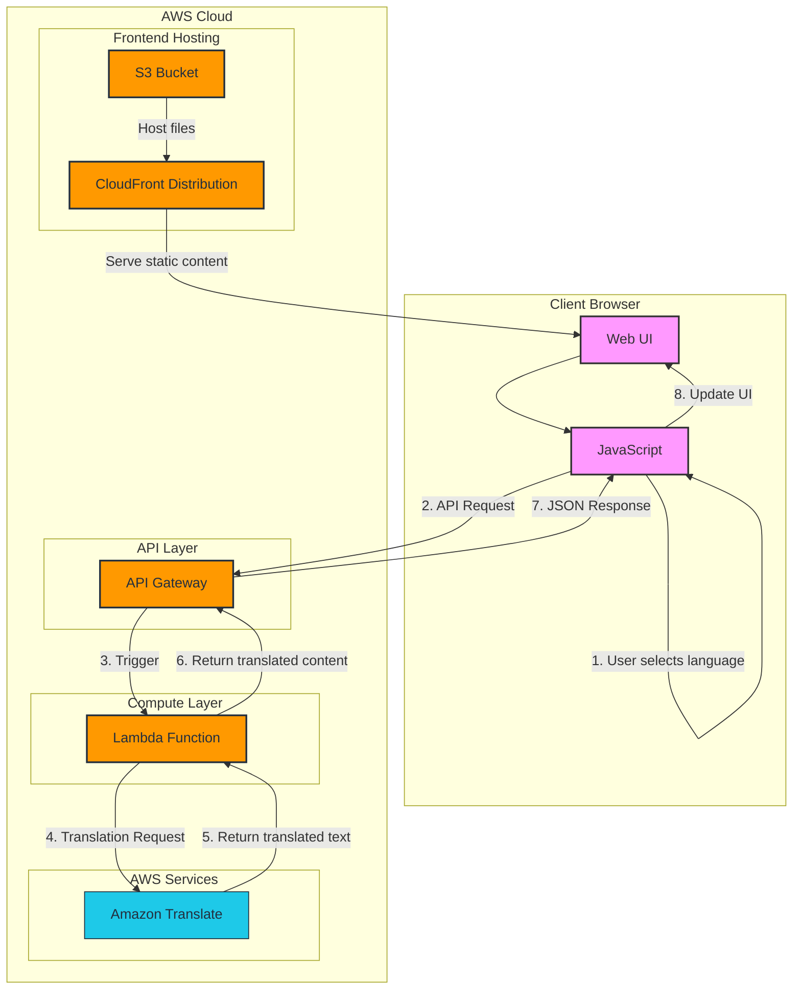
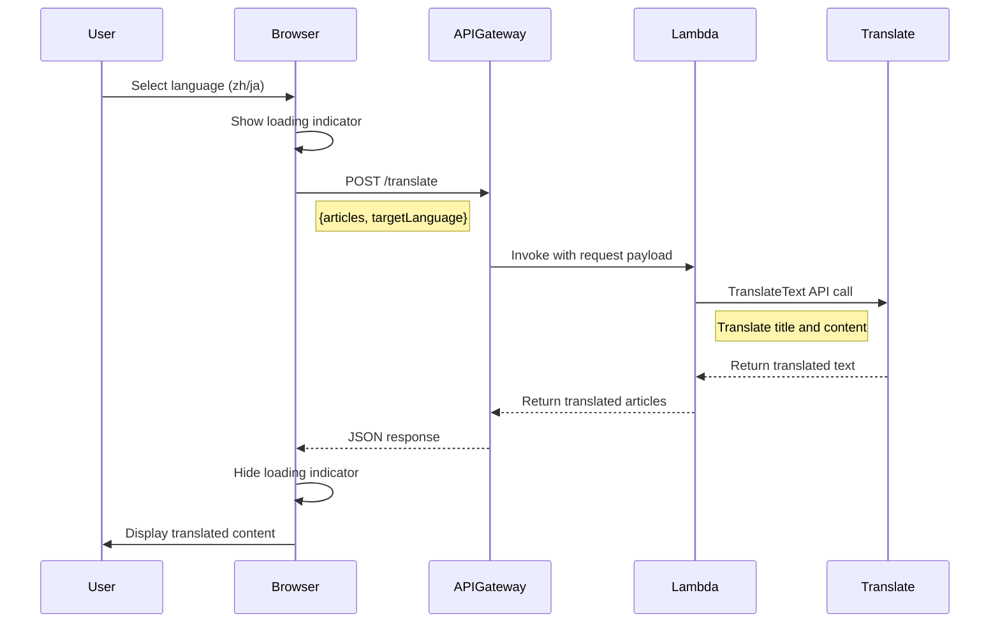
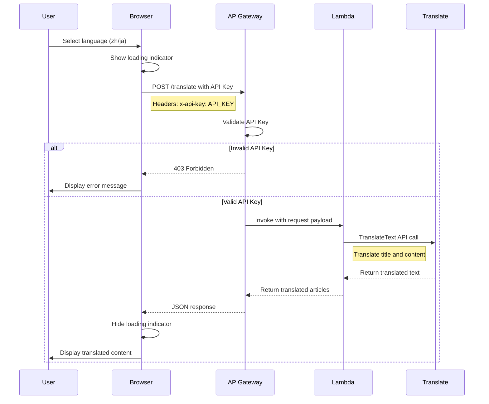

# TranslateWeb Solution Architecture

This document outlines the architecture of the TranslateWeb application, which provides multilingual news content using AWS services.

## Architecture Diagram

## Component Details

### Frontend Components
- **Web UI**: HTML/CSS interface with language selector and news display
- **JavaScript**: Client-side code that handles user interactions and API calls

### AWS Components
- **S3 Bucket**: Hosts the static website files (HTML, CSS, JS)
- **CloudFront**: Content delivery network for global distribution
- **API Gateway**: RESTful API endpoint that receives translation requests
- **Lambda Function**: Serverless function that processes translation requests
- **Amazon Translate**: AWS service that performs the actual translation

## Request Flow

1. **User Interaction**: User selects a language from the dropdown menu
2. **API Request**: JavaScript makes an API call to the API Gateway endpoint
3. **Lambda Trigger**: API Gateway triggers the Lambda function
4. **Translation Process**: Lambda function calls Amazon Translate service
5. **Response Processing**: Lambda receives translated content and formats the response
6. **API Response**: API Gateway returns the translated content to the client
7. **UI Update**: JavaScript updates the UI with the translated news articles

## Data Flow

## Scaling and Performance

The architecture is designed to scale automatically:

- **Lambda**: Scales automatically based on request volume
- **API Gateway**: Handles thousands of concurrent requests
- **CloudFront**: Provides global caching and edge distribution
- **Amazon Translate**: Managed service with high throughput capabilities

## Security Considerations

- **CORS**: API Gateway configured with appropriate CORS headers
- **IAM Roles**: Lambda function uses least-privilege permissions
- **CloudFront**: Can be configured with WAF for additional security
- **API Gateway**: Implements API Key authentication and rate limiting

## Security Architecture

### API Authentication

The API is secured using API Gateway's API Key authentication:

1. **API Key Required**: All requests to the `/translate` endpoint require a valid API key
2. **Usage Plan**: A usage plan limits the number of requests to prevent abuse:
   - Monthly quota: 1000 requests
   - Rate limit: 5 requests per second
   - Burst limit: 10 requests

3. **API Key Management**: API keys are managed through AWS API Gateway and can be rotated as needed

4. **CORS Configuration**: The API has proper CORS headers to restrict access to approved origins

### Request Flow with Authentication

